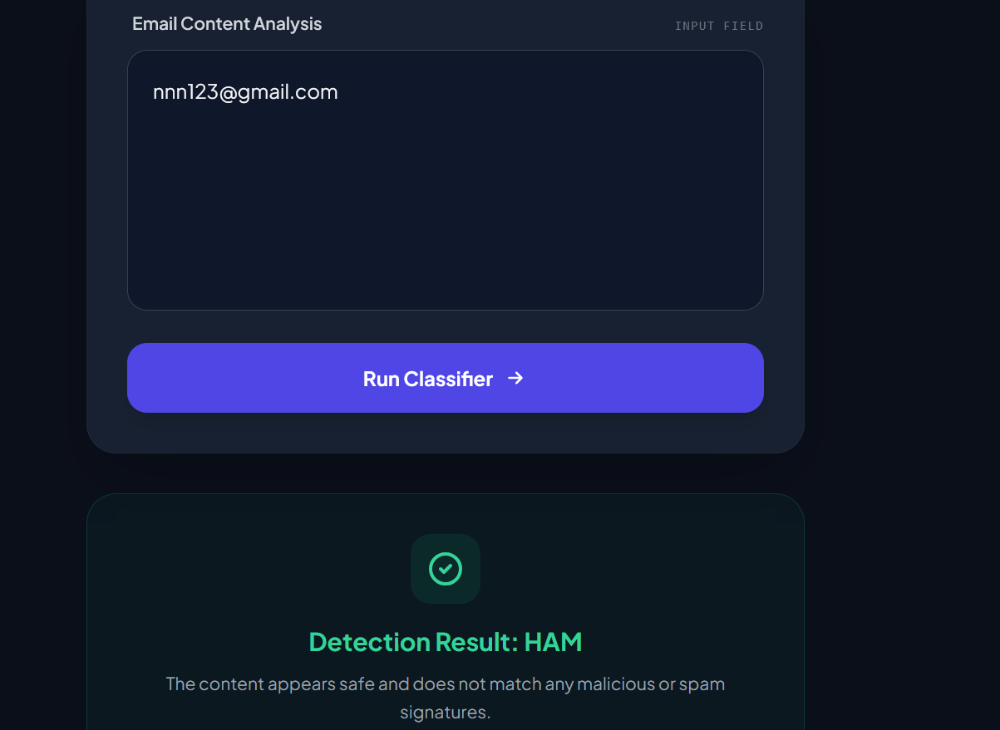
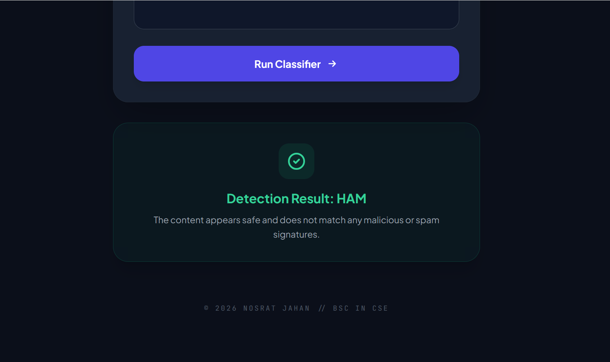

# 📧 AI Spam Mail Classifier
**Natural Language Processing (NLP) based Intelligent Categorization System**

[](https://opensource.org/licenses/MIT)
[](https://www.python.org/)
[](https://flask.palletsprojects.com/)
[](https://scikit-learn.org/)

---

## 🚀 Overview
The **Spam Mail Classifier** is a machine learning-driven web application designed to automatically detect and filter unwanted messages. Built with **Python** and **Flask**, it utilizes the **Multinomial Naive Bayes** algorithm combined with **TF-IDF Vectorization** to analyze text patterns and distinguish between **Spam** and **Ham** (Legitimate) content with high precision.

In an era of increasing digital threats, this tool serves as a practical implementation of AI in strengthening email security and defensive communication.

## ✨ Key Features
- **Linguistic Pattern Analysis:** Leverages Naive Bayes for efficient and accurate text classification.
- **Advanced Vectorization:** Implements **TF-IDF** (Term Frequency-Inverse Document Frequency) to weigh the importance of keywords.
- **Modern Dark UI:** A sleek, glassmorphic interface built with **Tailwind CSS** for an optimal user experience.
- **Instant Inference:** Real-time processing and prediction of input messages.
- **Cybersecurity Centric:** Designed to demonstrate proactive defense against phishing and social engineering attempts.

---

## 📸 Project Showcase

<p align="center">
  <strong>🖥️ Classifier Interface Overview</strong><br>
  
</p>

<p align="center">
  <strong>🔍 Real-time Classification Results</strong><br>
  
</p>

---

## 🛠️ Tech Stack
- **Backend:** Python 3.x, Flask (REST API)
- **Machine Learning:** Scikit-learn (MultinomialNB, TF-IDF Vectorizer)
- **Frontend:** HTML5, Tailwind CSS, Plus Jakarta Sans Typography
- **Tools:** NumPy, Gunicorn (Production Ready)

## 📂 Repository Structure
```text
├── app.py              # Core application logic & ML integration
├── templates/          # Responsive UI components
├── screenshots/        # Project visual documentation
├── requirements.txt    # Project dependencies
├── SECURITY.md         # Vulnerability reporting protocol
├── CONTRIBUTING.md     # Guidelines for collaboration
└── LICENSE             # MIT Open Source License
